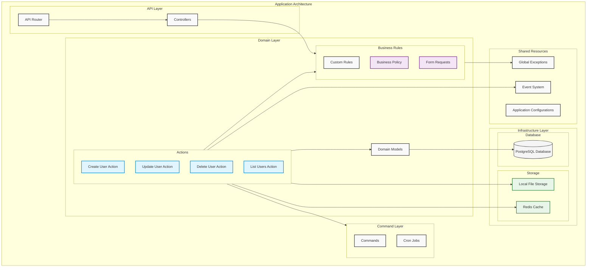

## Architecture

Para minimizar a quantidade de camadas e melhorar a testabilidade da aplicação utilizaremos o `Action Pattern`

```mermaid
---
config:
  theme: mc
  layout: fixed
---
flowchart TB
 subgraph API["API Layer"]
        Router["API Router"]
        Controllers["Controllers"]
  end
 subgraph CommandLine["Command Layer"]
        Commands["Commands"]
        Jobs["Cron Jobs"]
  end
 subgraph Actions["Actions"]
        CreateUserAction["Create User Action"]
        UpdateUserAction["Update User Action"]
        DeleteUserAction["Delete User Action"]
        ListUsersAction["List Users Action"]
  end
 subgraph BusinessRules["Business Rules"]
        CustomRules["Custom Rules"]
        BusinessPolicy["Business Policy"]
        FormRequest["Form Requests"]
  end
 subgraph Domain["Domain Layer"]
        Actions
        BusinessRules
        Models["Domain Models"]
  end
 subgraph Storage["Storage"]
        DiskLocal["Local File Storage"]
        Cache["Redis Cache"]
  end
 subgraph Database["Database"]
        MainDB[("PostgreSQL Database")]
  end
 subgraph Infrastructure["Infrastructure Layer"]
        Storage
        Database
  end
 subgraph Shared["Shared Resources"]
        Exceptions["Global Exceptions"]
        Events["Event System"]
        Config["Application Configurations"]
  end
 subgraph Monorepo["Application Architecture"]
        API
        CommandLine
        Domain
        Infrastructure
        Shared
  end
    Router --> Controllers
    Controllers --> BusinessRules
    BusinessRules --> Exceptions
    Actions --> BusinessRules & Models & CommandLine & DiskLocal & Cache & Events
    Models --> MainDB
     CreateUserAction:::action
     UpdateUserAction:::action
     DeleteUserAction:::action
     ListUsersAction:::action
     BusinessPolicy:::business
     FormRequest:::business
     DiskLocal:::infrastructure
     Cache:::database
     Cache:::infrastructure
     MainDB:::database
    classDef default fill:#f9f9f9,stroke:#333,stroke-width:2px
    classDef action fill:#e1f5fe,stroke:#0288d1,stroke-width:2px
    classDef business fill:#f3e5f5,stroke:#7b1fa2,stroke-width:2px
    classDef database fill:#f5f5f5,stroke:#666,stroke-width:2px
    classDef infrastructure fill:#e8f5e9,stroke:#2e7d32,stroke-width:2px

```