# Starter Kit LaraVue

Starter Kit Laravue is a powerful project template designed to jumpstart your development process. Combining Laravel and Vue 3, it provides a robust backend and a reactive front end. This kit includes pre-configured authentication, user and permission management, an initial dashboard, and a responsive side menu. With integrated automated testing, this starter kit ensures a solid foundation for building scalable and maintainable web applications.

## Features

- **Laravel Backend**: Utilizes Laravel, a modern PHP framework, for robust backend logic.
- **Vue 3 Frontend**: Leverages Vue 3, a progressive JavaScript framework, for building dynamic user interfaces.
- **Quasar Framework**: Utilizes Quasar, a UI framework, for a polished and responsive user interface.
- **Authentication**: Pre-configured user authentication out of the box.
- **User Management**: Easily manage user roles and permissions.
- **Permission Management**: Simplified management of user permissions.
- **Role Management**: Streamlined user role management.
- **Profile Management**: Manage user profiles efficiently.
- **Password Management**: Securely manage user passwords.
- **Initial Dashboard**: A starter dashboard to kickstart your project.
- **Side Menu**: A responsive and easily customizable side menu.
- **Automated Tests**: Pre-written tests to ensure your application functions correctly.
- **Logging**: Comprehensive logging for monitoring and debugging.
- **Larastan**: Automated code quality checks to maintain code quality.
- **Laravel Debugbar**: A powerful debugging tool for your Laravel applications.
- **Scramble Documentation**: A documentation generator for your Laravel application.
- 
## Stack

- **Laravel 11**
- **PHP 8.4**
- **Spatie Permission**
- **Vue 3.4**
- **Composition API**
- **Pinia**

## To Do

- [ ] Fix errors larastan.
- [ ] Create policies for roles, users and permissions(revisit what exists today with regard to permissions.js)
- [ ] Add more tests for roles, users and permissions.
- [ ] Create screen to display application logs
- [ ] Arrumar os testes unitários


## Arquitetura 

Para minimizar as camadas e melhorar a testabilidade da aplicação adotamos o Action Patern já embutido no Laravel sem necessidade de adicionar no service provider.



## DUMP do schema e DER do projeto

Esta instalado o postgresql client que permite o comando pg_dump para exportar o schema do projeto

```bash
pg_dump --schema-only --file=schema.sql "postgres://$(grep DB_USERNAME .env | cut -d '=' -f2):$(grep DB_PASSWORD .env | cut -d '=' -f2)@$(grep DB_HOST .env | cut -d '=' -f2):$(grep DB_PORT .env | cut -d '=' -f2)/$(grep DB_DATABASE .env | cut -d '=' -f2)"
```

Comando npm que gera uma pasta dist com o DER
```bash
npx @liam-hq/cli erd build --input $(pwd)/schema.sql --format=postgres

```
Move os arquivos gerados para a pasta public
```bash
mv $(pwd)/dist $(pwd)/public
```
O Diagrama de Entidade/Relação ficará disponível na rota `/der?key=chave_de_acesso`, é preciso preencher a variável de ambiente `APP_DER_KEY`.

Comandos disponíveis com a extensão do php-intl
- `php artisan db:show`
- `php artisan db:table users`
- `php artisan db:monitor`
